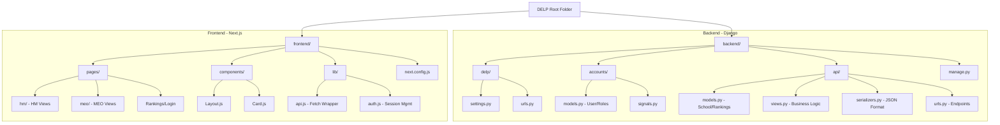

Readme · MD
🏫 Headmaster Sanmanam — HM Performance Tracking & Public Recognition Platform

Driving accountability and excellence in Indian government schools through data-driven ranking, transparency, and public recognition.

📖 Overview

Headmaster Sanmanam (Sanmanam — Telugu for "public honor/felicitation") is a web platform built to close a critical accountability gap in India's government school system: the absence of a structured, continuous, HM-centric monitoring and recognition mechanism.

While systems like PGI-D track performance at the district level and initiatives like AP's student felicitation programs recognize achievement at the student level, no platform in India currently tracks, ranks, and publicly recognizes Headmasters — the single most influential factor in a government school's day-to-day quality. This project fills that gap.

Born out of firsthand experience as a government school student, this platform is designed to motivate Headmasters through visibility and peer comparison rather than punitive oversight — turning good performance into public pride.

🎯 Problem Statement
Qualified Headmasters often operate without structured performance monitoring.
Lack of recognition demotivates high-performing HMs and cascades into weaker teacher supervision and student outcomes.
Existing systems (PGI-D, UDISE+, state-level disciplinary/felicitation schemes) are either too aggregated (district-level) or too narrow (student-level) to close the loop at the HM layer.
💡 Solution

A continuous, transparent, and public HM ranking and recognition ecosystem built around three pillars:

Pillar	Description
📊 Data-Driven Ranking	HMs are ranked primarily on Class 10 / SSC results, with configurable pass-percentage thresholds for fairness across schools.
🏆 Public Felicitation (Sanmanam)	High-performing HMs are publicly celebrated through achievement posts, milestones, and visibility — not just administrative memos.
👥 Peer Visibility	Mandal- and district-level comparisons let HMs see where they stand, turning quiet competence into visible excellence.


✨ Key Features
HM Ranking Engine — Performance percentage with grace marks (extracurricular bonus points) displayed in a visually subordinate style (smaller font, distinct color) to preserve ranking transparency and prevent score inflation perception.
HM Profile Pages — Historical performance graphs with mandal/district average overlays and milestone markers.
Achievement Feed — Social-feed-style posts with photo/video uploads and public comments, celebrating HM and school wins.
Report & Appeal System — Structured box for HMs to flag teacher shortages, infrastructure gaps, or ranking disputes, with full status tracking.
Role-Based Interfaces:
🧑‍🏫 HM Dashboard — performance tracking, achievement posting, appeals.
🏛️ MEO Dashboard — mandal-level oversight and administration.
🌐 Public Interface — static, read-only view for parents and citizens (GIGW-compliant).


🛠️ Tech Stack
Layer	Technology	Why
Backend	Django (Python)	Built-in admin panel + robust role-based access control (RBAC) out of the box — chosen over FastAPI, which lacks these natively.
Frontend	React / Next.js	Handles the complexity of multiple dynamic, role-specific dashboards better than static HTML/CSS/JS.
Design Standard	GIGW (Guidelines for Indian Government Websites)	Ensures accessibility and compliance for a public-sector-facing platform.
Data Context	UDISE+, PGI-D	Reference points for existing government education data infrastructure.

🧭 Design Principles
Transparency over inflation — Grace marks are always visually distinct from core performance metrics.
Recognition over punishment — Public visibility and peer comparison are the primary motivators, not penalties.
Fill the gap, don't duplicate — Purpose-built for the HM layer, complementing (not replacing) PGI-D and student-level systems.
📌 Status

🚧 Currently in the specification and pre-development phase. Core documents (agent.md, website-build-prompt.md) define the full technical and functional scope and are ready for developer handoff.

🙏 Acknowledgment

This project is inspired by lived experience within India's government school system, aiming to give Headmasters the recognition their work deserves — and the accountability the system needs.

# 🏛️ District Education Leadership Portal (DELP)


A high-performance, government-grade digital ecosystem designed to monitor, track, and rank school leadership performance. The portal transforms academic result data into actionable leadership insights for District and Mandal Education Officers.

---
DELP (Root Folder)
 ├── backend/             <-- The "Brain" (Django)
 │    ├── delp/           <-- Main Settings (The control center)
 │    ├── accounts/       <-- User accounts, roles, and passwords
 │    ├── api/            <-- The Logic (How ranks are calculated)
 │    └── manage.py       <-- The tool to start the backend
 │
 └── frontend/           <-- The "Face" (Next.js)
      ├── pages/          <-- The actual screens (Login, Dashboard, etc.)
      ├── components/      <-- Small UI pieces (Buttons, Cards, Layout)
      ├── lib/            <-- Helper tools (Talking to the backend)
      └── next.config.js  <-- Connection settings
```

### 💡 In Simple Words:
- **Backend**: This is where the data lives. It checks if your password is correct and calculates who is the top-ranked school.
- **Frontend**: This is what the user sees. It takes the data from the backend and shows it in a beautiful dashboard with charts.
## 🌐 System Architecture & Data Flow

The DELP system is built using a **Decoupled Architecture**, ensuring that the user interface (Frontend) and the business logic (Backend) can evolve independently.

### 🔄 The Request Life Cycle
1. **Client Request**: A user interacts with the Next.js frontend (Port 3000).
2. **API Proxy**: Requests starting with `/api` are intercepted by the Next.js rewrite engine and proxied to the Django server (Port 8000).
3. **Authentication**: The Django backend verifies the `Token` in the request header using DRF Token Authentication.
4. **Business Logic**: The `api` app processes the request (e.g., computing rankings based on qualifying percentages).
5. **Data Persistence**: Django interacts with the PostgreSQL database to retrieve or store records.
6. **JSON Response**: The backend sends a structured JSON response back through the proxy to the frontend.

### 🗺️ Project Hierarchy (Visual Map)



---

## 🚀 Step-by-Step Installation Guide

Follow these steps precisely to get the environment running on your machine.

### 1️⃣ Prerequisites
- **Python 3.10+**
- **Node.js 18+**
- **PostgreSQL** (Installed and running)

### 2️⃣ Database Initialization
Open your PostgreSQL terminal (pgAdmin or psql) and run:
```sql
CREATE DATABASE delp_db;
CREATE USER delp_user WITH PASSWORD 'your_secure_password';
GRANT ALL PRIVILEGES ON DATABASE delp_db TO delp_user;
```

### 3️⃣ Backend Setup
```bash
# Enter backend directory
cd backend

# Create and activate virtual environment
python -m venv .venv
.venv\Scripts\activate          # Windows
# source .venv/bin/activate     # macOS/Linux

# Install dependencies
pip install -r requirements.txt

# Setup Environment Variables
# Create a .env file and add:
# DB_NAME=delp_db
# DB_USER=delp_user
# DB_PASSWORD=your_secure_password
# SECRET_KEY=your_random_secret_key

# Run Database Migrations
python manage.py migrate

# Seed the database with Pilot Data (Essential for first-time run)
python manage.py seed_pilot

# Start the server
python manage.py runserver
```
**Backend URL:** `http://localhost:8000` | **Admin Panel:** `http://localhost:8000/admin/`

### 4️⃣ Frontend Setup
```bash
# Enter frontend directory
cd frontend

# Install Node modules
npm install

# Start the development server
npm run dev
```
**Frontend URL:** `http://localhost:3000`

---

## 🔑 Testing the System (Demo Credentials)

Use these accounts to verify the role-based workflows:

| Role | Email | Password | Key Workflow |
|---|---|---|---|
| **Headmaster** | `hm1@pilot.test` | `demo1234` | Submit Results $\rightarrow$ View Performance Trend |
| **Mandal Officer** | `meo1@pilot.test` | `demo1234` | Open Queue $\rightarrow$ Verify $\rightarrow$ Update Rankings |

---

## 🛠️ Developer Notes

### Ranking Algorithm
The portal uses a dynamic ranking system. Whenever an MEO approves a `ResultSubmission`, the system triggers a re-calculation of ranks for all schools in that specific Mandal for that academic year, ensuring the Rank Board is always real-time.

### Theming
The UI follows the **Gov-Digital Design System**:
- **Primary Navy (`#0B3D91`)**: Represents trust and authority.
- **Accent Saffron (`#FF9933`)**: Represents growth and leadership.
